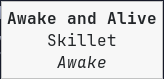
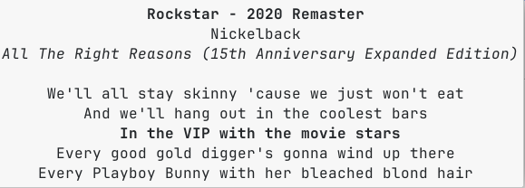

# waybar-mediaplayer (GABRIWAR VERSION FIXED LYRICS AND THEMING)

## Introduction

This is a mediaplayer for [waybar](https://github.com/Alexays/Waybar).

Widget with album art and progress bar:


Notification with album art, track ticle and track artist


Tooltip with track title, track artist and track album:



Synced lyrics in tooltip:



It features:
1. Multi-player support (Firefox, Chrome, Chromium, Thorium, Spotify, and more)
2. Right-click to cycle through active players
3. Progress bar
4. Tooltip that displays title, author and album
5. Synced lyrics in tooltip
6. Album cover art (click to zoom)
7. Optional notification on song change
8. Click to play/pause, scroll up/down for next/previous track

## Requirements

- [playerctl](https://github.com/altdesktop/playerctl) must be installed
- The default configuration uses Nerd Fonts, so it requires waybar to use a Nerd Font
- The default configuration uses [feh](https://github.com/derf/feh) to open the album art image

## Install

1. Create a virtual environment within which to run waybar. For example, using pyenv this would be:

    ```
    pyenv virtualenv 3.12.0 waybar
    pyenv activate waybar
    ```

1. Create a wrapper script to run waybar inside this virtual environment.

    For example, always using pyenv, create the file `start_waybar` and put it in your PATH:
    ```
    #!/usr/bin/env bash
    . ~/.pyenv/versions/waybar/bin/activate
    waybar
    ```

1. Clone this repo:

    ```
    git clone https://github.com/raffaem/waybar-mediaplayer "$HOME/.config/waybar/waybar-mediaplayer"
    cd "$HOME/.config/waybar/waybar-mediaplayer"
    ```

1. Install the required python packages inside your virtual environment:

    ```
    pip3 install -r requirements.txt
    ```

1. You can configure which players to support by editing `"$HOME/.config/waybar/waybar-mediaplayer/src/config.json`. The default configuration supports Firefox, Chrome, Chromium, Thorium, and Spotify:

    ```json
    "player_name": ["firefox", "chrome", "chromium", "thorium", "spotify"]
    ```

    To find available players on your system, run `playerctl --list-all` while your media player is running. You can add or remove players from this list as needed.

1. Put the following in `$HOME/.config/waybar/config`:

    ```
    "modules-left": ["image", "custom/mediaplayer"],
    ```

    ```
    "image": {
      "path": "/tmp/waybar-mediaplayer-art",
      "size": 32,
      "interval": 1,
      "on-click": "feh --auto-zoom --borderless --title 'feh-float' /tmp/waybar-mediaplayer-art"
    },

    "custom/mediaplayer": {
        "exec": "$HOME/.config/waybar/waybar-mediaplayer/src/mediaplayer monitor",
        "return-type": "json",
        "restart-interval": 5,
        "format": "{}",
        "on-click": "$HOME/.config/waybar/waybar-mediaplayer/src/mediaplayer play-pause",
        "on-click-right": "$HOME/.config/waybar/waybar-mediaplayer/src/mediaplayer select",
        "on-scroll-up": "$HOME/.config/waybar/waybar-mediaplayer/src/mediaplayer next",
        "on-scroll-down": "$HOME/.config/waybar/waybar-mediaplayer/src/mediaplayer previous",
        "min-length": 20,
        "max-length": 20
    },
    ```

    > **Note:** `interval: 1` is used instead of `signal` for the image module. Using `signal` causes waybar to freeze on multi-monitor setups because two bar instances send `SIGRTMIN` simultaneously, deadlocking the GTK signal handler. Interval-based polling avoids this entirely.

    > **Note:** `restart-interval: 5` is required on waybar 0.15.0. That version defaults `restart-interval` to 0, causing an immediate restart loop when the mediaplayer crashes, which starves the GTK event loop and breaks **all tooltips** across the entire bar.

    Put the following in `$HOME/.config/waybar/style.css`:

    ```
    #custom-mediaplayer
    {
      font-size: 16px;
      border-radius: 2%;
    }
    @import "./waybar-mediaplayer/src/style.css";
    ```

1. Start waybar using the wrapper script `start_waybar`.

The mediaplayer should work with the following controls:
- **Left click**: Play/pause
- **Right click**: Cycle through active players
- **Scroll up**: Next track
- **Scroll down**: Previous track

## Update

```
cd "$HOME/.config/waybar/waybar-mediaplayer"
git pull
```

## Personalization

### Multiple Players

The widget supports monitoring multiple media players simultaneously. Right-click on the widget to cycle through all available players. The selected player becomes the active player for controls (play/pause, next, previous). Your selection persists across sessions.

If no player is selected, the widget automatically uses the first available player from your configured list.

### Other Options

To disable notifications, put `is_notification=false` in `config.json`.

To change widget's length, set `min-length` and `max-length` in `$HOME/.config/waybar/config`, and set `widget_length` in `$HOME/.config/waybar/waybar-mediaplayer/src/config.json`. These 3 variables MUST be set to the same value.

Album art updates automatically via interval polling. The `signal`-based approach is no longer used — see the install notes above.

If you change the colors of the bar in `$HOME/.config/waybar/waybar-mediaplayer/src/config.json`, make sure to apply the changes by running `$HOME/.config/waybar/waybar-mediaplayer/src/mkstyle` and restart waybar.

## Troubleshooting

### Browser Support (Firefox, Chrome, etc.)

Browsers with MPRIS support are now natively supported. Firefox, Chrome, Chromium, and Thorium work out of the box.

**Note for Firefox users**: If you experience issues with the progress bar (Firefox may not always report song length), you can optionally install the [Plasma Integration](https://addons.mozilla.org/en-US/firefox/addon/plasma-integration) add-on for better metadata support. If using this add-on, add `"plasma-browser-integration"` to your `player_name` array in `config.json`.

For album art from browsers, you may need to set `convert_to_jpeg` to `true` in `config.json` (this option may decrease performance slightly).

### Me progress bar doesn't work

It's likely cause by the player not reporting song length or position back to us. Run `$HOME/.config/waybar/waybar-mediaplayer/src/mediaplayer -vvv` to debug.

### Player reports its name with instance number

This is handled automatically. If a player reports an instance number after its name (e.g., `spotify.instance12345`), you only need to configure the base player name (e.g., `"spotify"`) in `config.json`. The software will automatically match any player whose name starts with the configured name.

### Me title and tooltip are empty

It's likely your song file doesn't contain metadata.

Run `exiftool SONG.mp3` and check the `Title`, `Album` and `Artist` fields.

### Me album art doesn't change on song change

Make sure that the `signal` in the `image` module in `$HOME/.config/waybar/config` matches the number provided by `image_signal` in `$HOME/.config/waybar/waybar-mediaplayer/src/config.json`.

